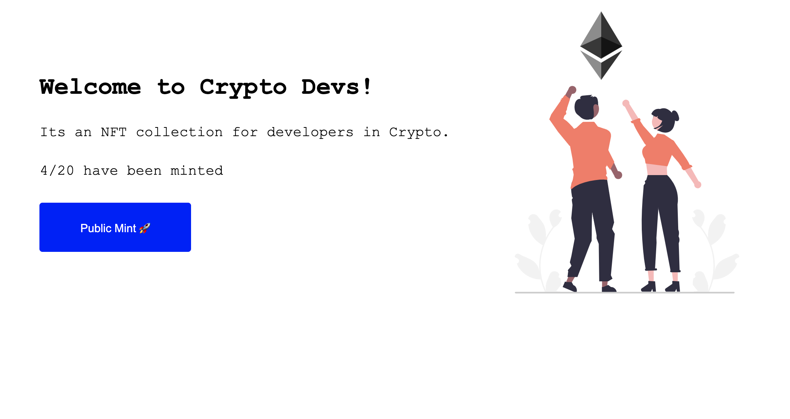
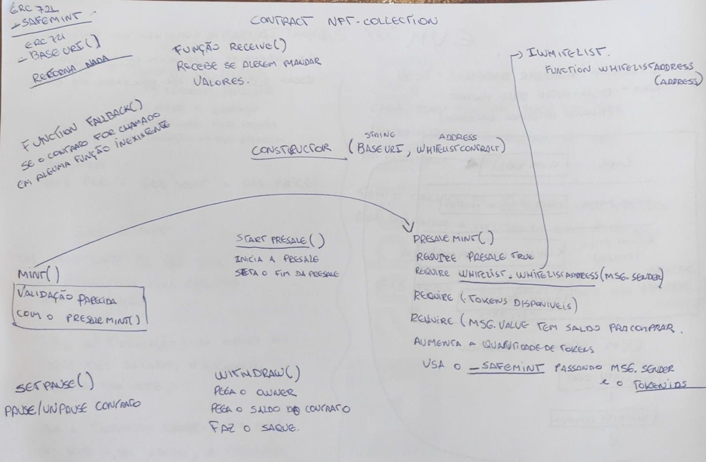

# NFT Collection

This project demonstrates a NFT collection following the instructions:

- There should only exist 20 Crypto Dev NFT's and each one of them should be unique.
- User's should be able to mint only 1 NFT with one transaction.
- Whitelisted users, should have a 5 min presale period before the actual sale where they are guaranteed 1 NFT per transaction.
- There should be a website for your NFT Collection.

## Just to remember you...

- What is a Non-Fungible Token? Fungible means to be the same or interchangeable eg Eth is fungible. With this in mind, NFTs are unique; each one is different. Every single token has unique characteristics and values. They are all distinguishable from one another and are not interchangeable eg Unique Art

- What is ERC-721? ERC-721 is an open standard that describes how to build Non-Fungible tokens on EVM (Ethereum Virtual Machine) compatible blockchains; it is a standard interface for Non-Fungible tokens; it has a set of rules which make it easy to work with NFTs. Before moving ahead have a look at all the functions supported by ERC721

## About Smartcontracts

- We would also be using Ownable.sol from Openzeppelin which helps you manage the Ownership of a contract

- By default, the owner of an Ownable contract is the account that deployed it, which is usually exactly what you want.
- Ownable also lets you:
- TransferOwnership from the owner account to a new one, and
- renounceOwnership for the owner to relinquish this administrative privilege, a common pattern after an initial stage with centralized administration is over.
  ⋅⋅⋅ We would also be using an extension of ERC721 known as ERC721 Enumerable

- ERC721 Enumerable is helps you to keep track of all the tokenIds in the contract and also the tokensIds held by an address for a given contract.



## Running the code

#### **Blockend**

To build the smart contract we would be using Hardhat. Hardhat is an Ethereum development environment and framework designed for full stack development in Solidity. In simple words you can write your smart contract, deploy them, run tests, and debug your code.

Once all needed files are here, you just need run:

`npm install`

Now create a .env file in the hardhat-tutorial folder and add the following lines, use the instructions in the comments to get your Alchemy API Key URL and RINKEBY Private Key. Make sure that the account from which you get your rinkeby private key is funded with Rinkeby Ether.

```
// Go to https://www.alchemyapi.io, sign up, create
// a new App in its dashboard and select the network as Rinkeby, and replace "add-the-alchemy-key-url-here" with its key url
ALCHEMY_API_KEY_URL="add-the-alchemy-key-url-here"

// Replace this private key with your RINKEBY account private key
// To export your private key from Metamask, open Metamask and
// go to Account Details > Export Private Key
// Be aware of NEVER putting real Ether into testing accounts
RINKEBY_PRIVATE_KEY="add-the-rinkeby-private-key-here"

```

#### **FrontEnd**

To develop the website we used React and Next Js. React is a javascript framework which is used to make websites and Next Js is built on top of React.

Get in the my-app folder and run:

`npm install`

`npm run dev`

Now go to http://localhost:3000, your app should be running 🤘
